# DeepSleep 系统架构文档

## 1. 系统架构图

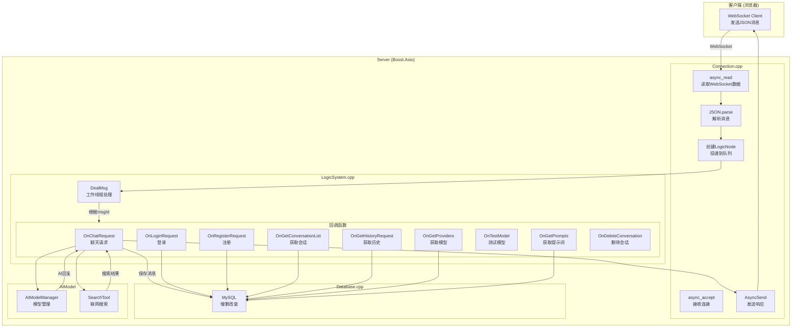

---

## 2. 详细时序图

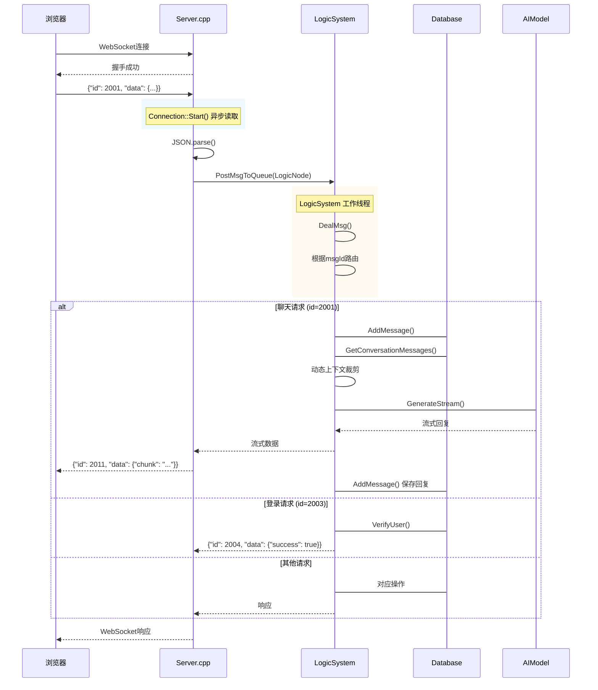

---

## 3. OnLoginRequest 登录请求流程

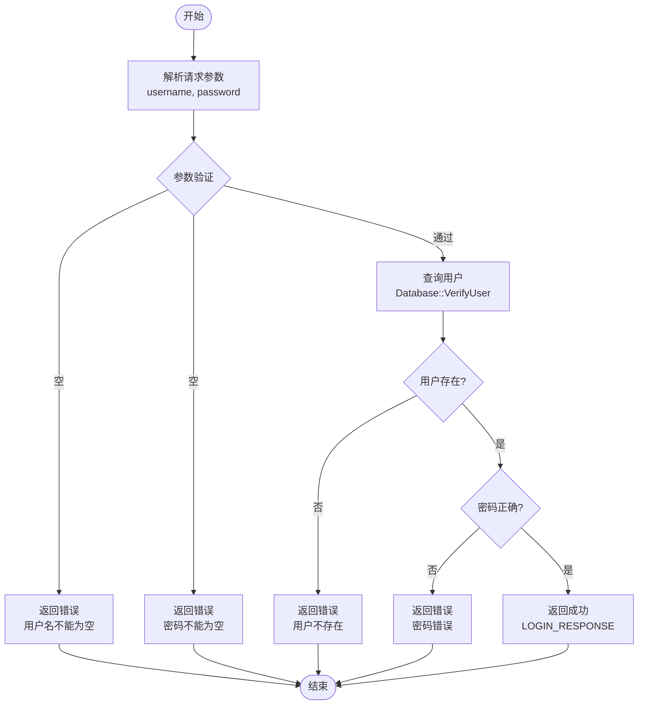

---

## 4. OnRegisterRequest 注册请求流程

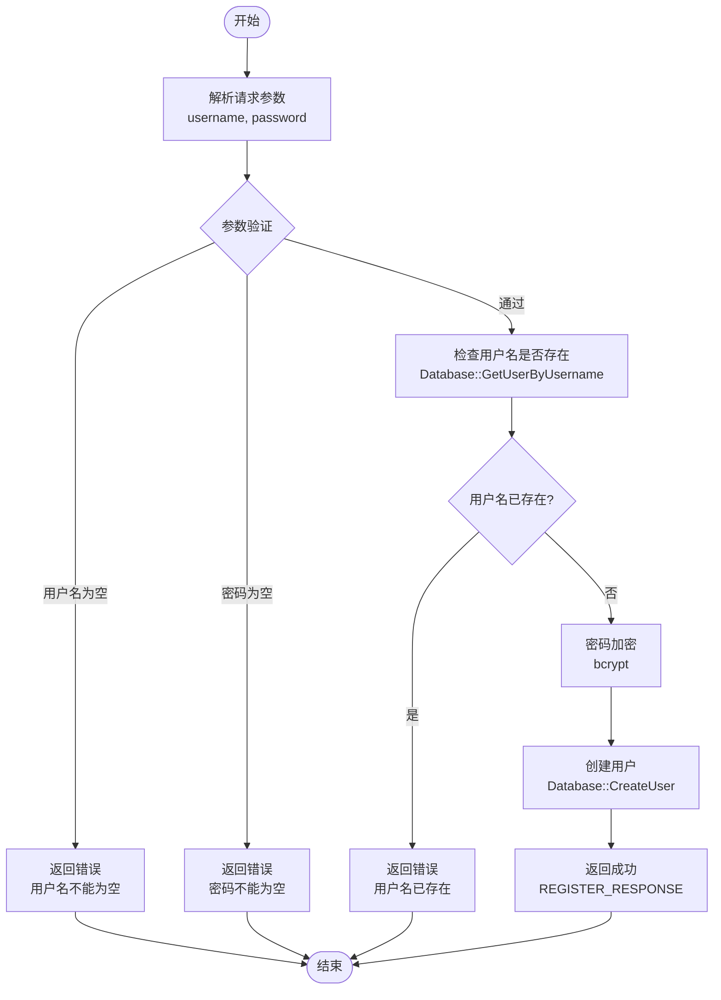

---

## 5. OnGetConversationList 获取会话列表流程

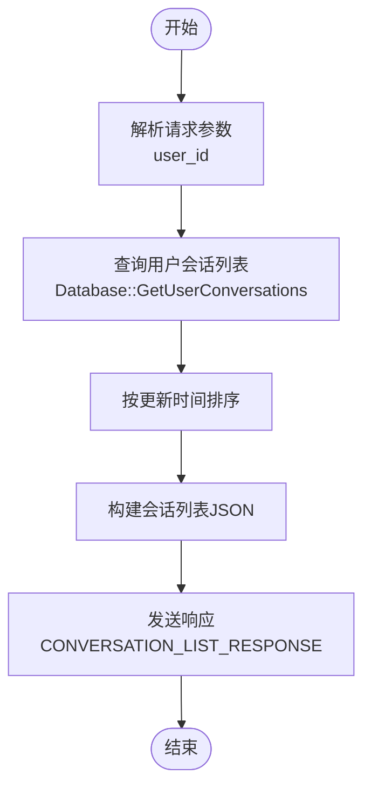

---

## 6. OnCreateConversation 创建会话流程

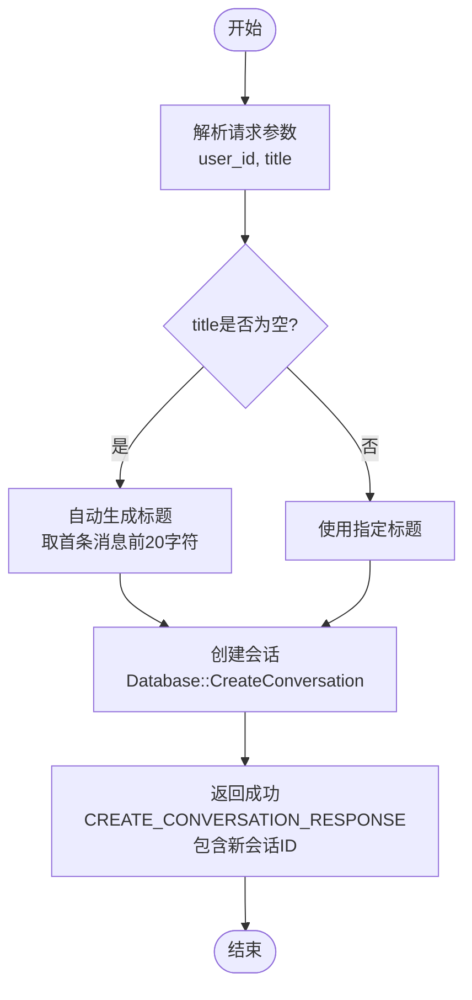

---

## 7. OnGetHistoryRequest 获取历史消息流程

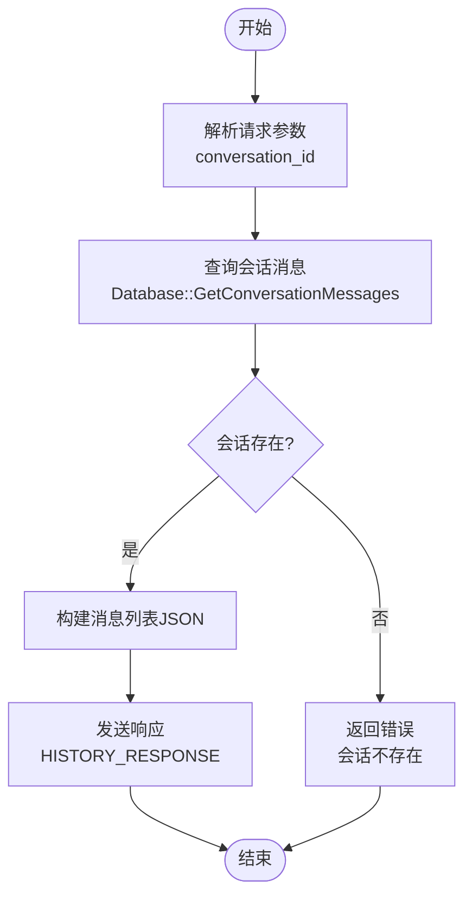

---

## 8. OnGetProviders 获取模型提供商流程

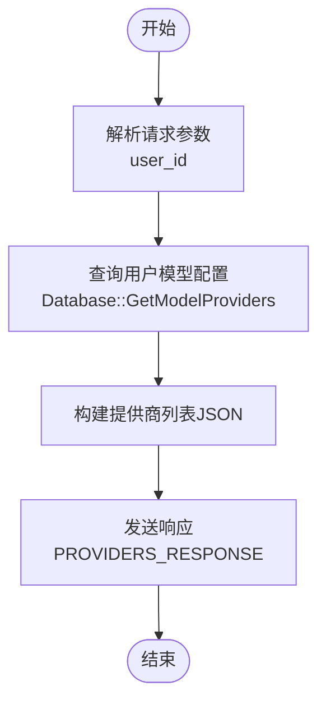

---

## 9. OnAddProvider 添加模型提供商流程

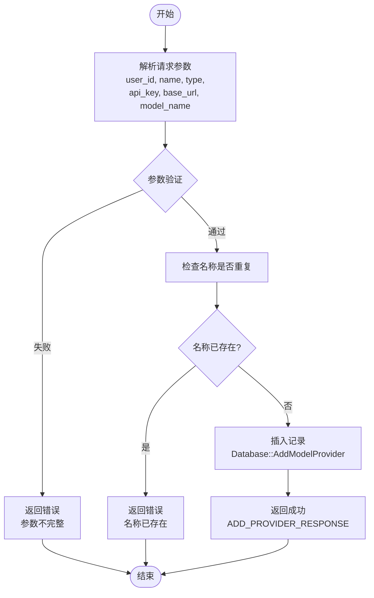

---

## 10. OnDeleteProvider 删除模型提供商流程

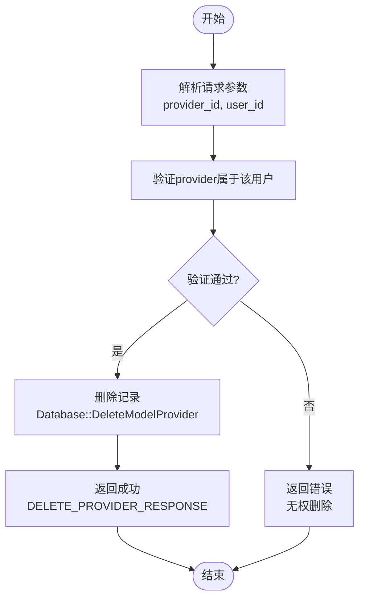

---

## 11. OnTestModel 测试模型连接流程

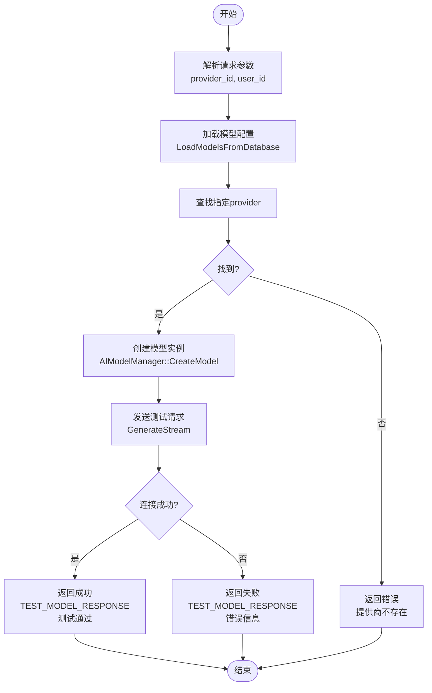

---

## 12. OnGetPrompts 获取提示词流程

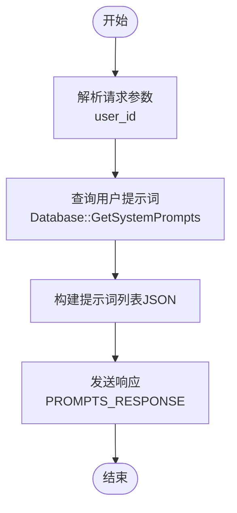

---

## 13. OnAddPrompt 添加提示词流程

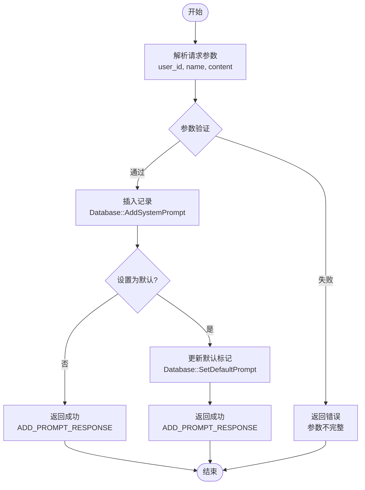

---

## 14. OnDeletePrompt 删除提示词流程

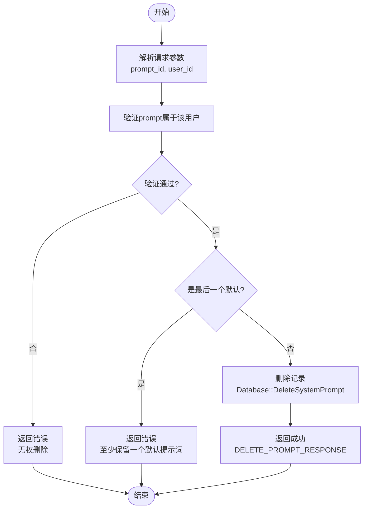

---

## 15. OnDeleteConversation 删除会话流程

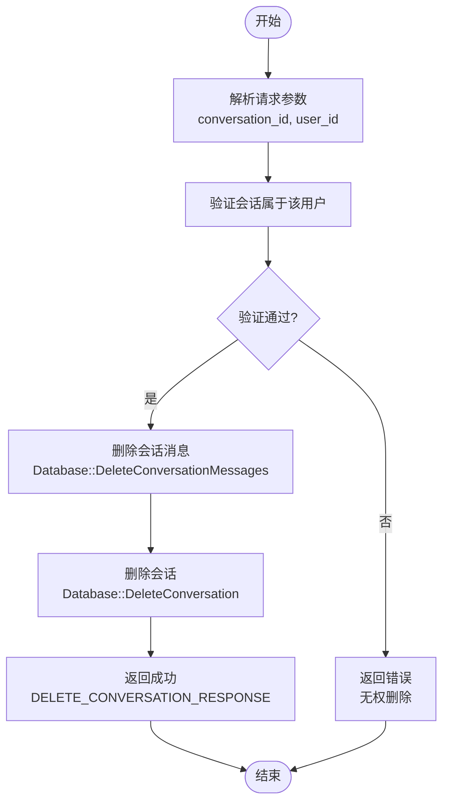

---

## 16. OnChatRequest 聊天请求流程

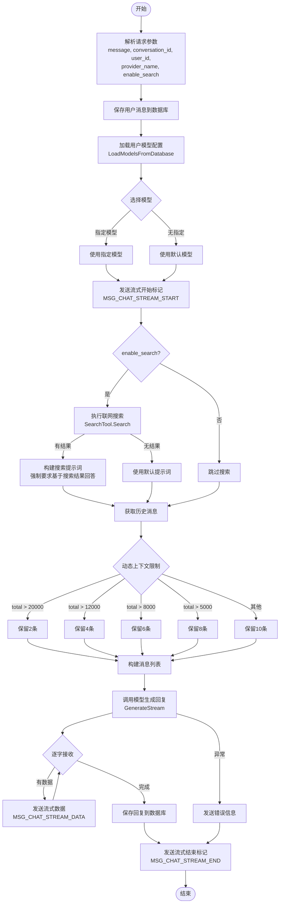

---

## 17. 模块职责表

| 模块 | 文件 | 职责 |
|------|------|------|
| **Server** | Server.cpp | 启动服务，监听端口，建立连接 |
| **Connection** | Connection.cpp | WebSocket读写，JSON解析，投递LogicNode，发送响应 |
| **LogicSystem** | Logic_System.cpp | 消息队列，消费线程，路由到各回调函数 |
| **Database** | Database.cpp | MySQL操作（用户、会话、消息、模型配置） |
| **AIModel** | OpenAIModel.cpp | 调用大模型API，流式返回 |
| **SearchTool** | SearchTool.cpp | DuckDuckGo联网搜索 |

---

## 6. 消息ID对照表

### 客户端 → 服务器

| 消息ID | 名称 | 说明 |
|--------|------|------|
| 2001 | CHAT_REQUEST | 发送聊天消息 |
| 2003 | LOGIN_REQUEST | 登录请求 |
| 2005 | REGISTER_REQUEST | 注册请求 |
| 2007 | CONVERSATION_LIST | 获取会话列表 |
| 2008 | CREATE_CONVERSATION | 创建会话 |
| 2009 | HISTORY_REQUEST | 获取历史消息 |
| 2013 | GET_PROVIDERS | 获取模型提供商 |
| 2015 | ADD_PROVIDER | 添加提供商 |
| 2017 | DELETE_PROVIDER | 删除提供商 |
| 2025 | GET_PROMPTS | 获取系统提示词 |
| 2027 | ADD_PROMPT | 添加提示词 |
| 2029 | DELETE_PROMPT | 删除提示词 |
| 2030 | SET_DEFAULT_PROMPT | 设置默认提示词 |
| 2031 | DELETE_CONVERSATION | 删除会话 |
| 2032 | TEST_MODEL | 测试模型连接 |

### 服务器 → 客户端

| 消息ID | 名称 | 说明 |
|--------|------|------|
| 2002 | CHAT_RESPONSE | AI回复（完整） |
| 2004 | LOGIN_RESPONSE | 登录响应 |
| 2006 | REGISTER_RESPONSE | 注册响应 |
| 2010 | CHAT_STREAM_START | 流式输出开始 |
| 2011 | CHAT_STREAM_DATA | 流式数据 |
| 2012 | CHAT_STREAM_END | 流式输出结束 |
| 2014 | PROVIDERS_RESPONSE | 提供商列表 |
| 2026 | PROMPTS_RESPONSE | 提示词列表 |
| 2033 | TEST_MODEL_RESPONSE | 测试模型响应 |

---

## 7. 数据库ER图

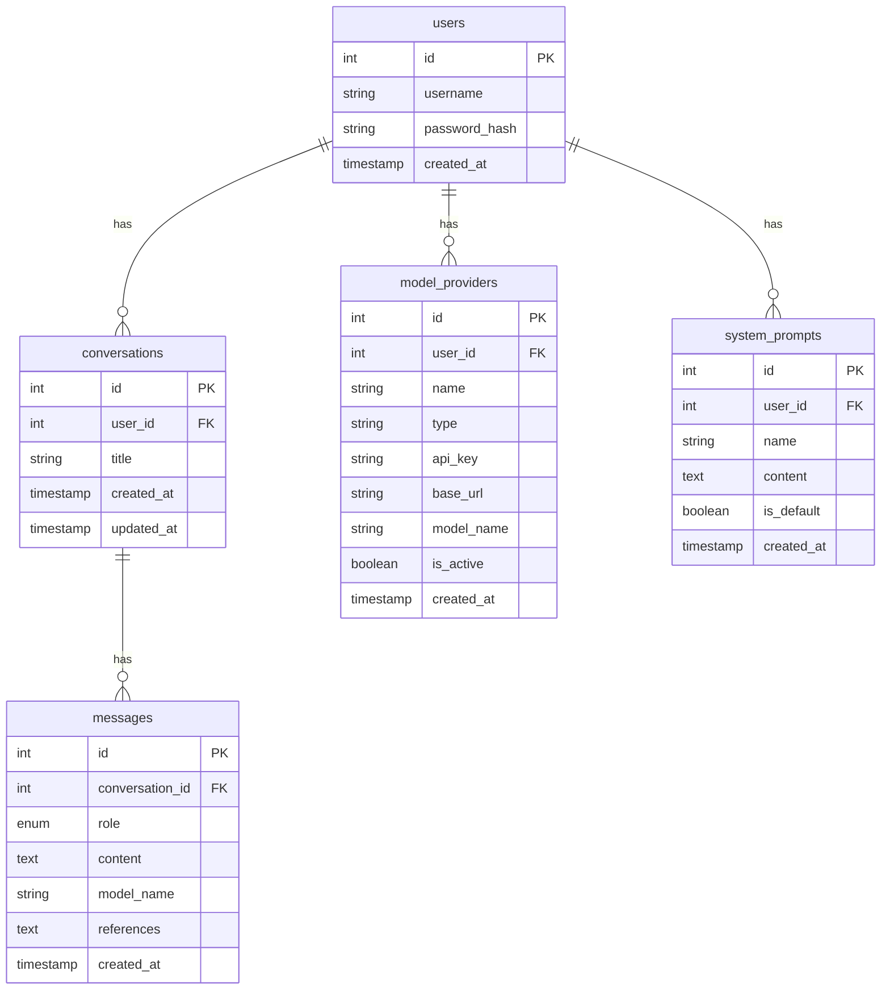

---

## 20. 技术栈

### 后端
- **语言**: C++14
- **网络**: Boost.Asio + Boost.Beast (WebSocket/HTTP)
- **数据库**: MySQL 8.0
- **JSON**: jsoncpp

### 前端
- **HTML5 + CSS3 + JavaScript**
- **WebSocket** 实时通信
- **响应式设计**